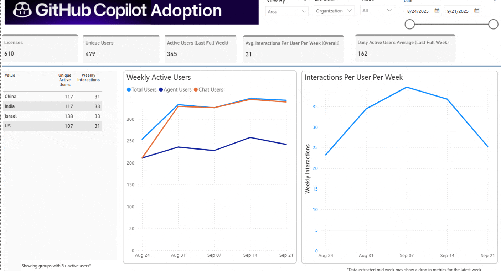

# 🚀 GitHub Copilot Impact
Analytics to show how developers build habits with GitHub Copilot—what features they use, how engagement changes, and what drives adoption. Helps teams and leaders understand usage and show business value. Use organizational data to zoom in teams that are pulling ahead with agentic coding vs. the rest. Learn the patterns from these early leaders and drive adoption across the board.

<strong>✨ What You’ll Get</strong>

- **Track Adoption and Engagment:**  
  See weekly active users, interactions, split by chat vs. agent mode - split by teams.
  Glean intensity and frequency of interaction with GitHub Copilot by teams

- **Measure Impact:**  
  View code activity, acceptance rates, lines of code suggested and added over time, segmented by teams.

- **Language Insights:**  
  Learn how acceptance rate, code gen activity, code accept activity varies by language.
  Split the views by teams to see if certain teams are finding greater success than others. 

- **Feature Insights:**  
 Learn how accceptance, code gen, code accept activity vary by features like code completion, agent mode, inline edits etc.
 Useful in answering questions like 'Do Principal Engineers have a higher acceptance rate? Do they have a greater adoption of agent mode?'

 - **Feature Insights:**  
 Learn how accceptance, code gen, code accept activity vary by features like code completion, agent mode, inline edits etc.
 Useful in answering questions like 'Do Principal Engineers have a higher acceptance rate? Do they have a greater adoption of agent mode?'

  - **Model Insights:**  
Glean which models are contributing to the code base, and which models are acquiring new users.

  - **Goal Tracking:**  
Set adoption targets by teams and identify hotspots and bright-spots.

<strong>🖼 Preview</strong>

<strong>✅ Requirements</strong>

- Power BI Desktop installed  
- GitHub admin access
- Enforced single sign on to enable connection between enterprise id and github handles
- Opt-in to the Copilot usage metrics policy under "AI Controls"

<strong>📥 Get Started</strong>

## ✅ What You’ll Do

📤 Step 1: Export 3 Files

- **GitHub Copilot Usage Insights** from GitHub 
- **GitHub Members** from GitHub
- **Org data** from Microsoft Entra Admin Center  

🔐 Step 2: Light up the PBI template by providing file paths

- Download the .pbit file  
- Paste full file paths for each CSV into the Power BI (PBI) template:
  

## 📁 Detailed Steps

🔍 GitHub Copilot Usage Insights from GitHub

- Sign in to GitHub with an account that has Enterprise Owner permissions
- Navigate to https://github.com/settings/enterprises and select your Enterprise
  - On the top ribbon, navigate far right to breadcrumbs (...) and access **Insights**    
- Select Copilot Usage  
  - Select Last 28 days option and click download  
- Save it as a .json file  

📖 Learn more: [View Usage and Adoption of Copilot](https://docs.github.com/en/enterprise-cloud@latest/copilot/how-tos/administer-copilot/manage-for-enterprise/view-usage-and-adoption)

👤 GitHub Members from GitHub

- Sign in to GitHub with an account that has Enterprise Owner permissions.
- In the top-right corner, click your profile picture.
- From the menu: Click Enterprise, or if you manage multiple, click Enterprises and select the enterprise you want.
  - At the top of the enterprise page, click People.
- On the **Members** section:
  - Look to the right side of the page and click CSV Report.
- Download the file:
  - If your enterprise has fewer than 1,000 members, the CSV downloads immediately.
  - If your enterprise has 1,000 or more members, GitHub will email you a link to download the report.

📖 Learn more: [GitHub Members Download](https://docs.github.com/en/enterprise-cloud@latest/admin/managing-accounts-and-repositories/managing-users-in-your-enterprise/exporting-membership-information-for-your-enterprise)

📥 User and Org Data from Entra

1. Sign in to the [Microsoft Entra admin center](https://entra.microsoft.com)  
2. In the left-hand navigation, go to: `Identity ➝ Users`  
3. Select **All users**  
4. Click the **“Download users”** button (in the toolbar or under the `...` menu)  
5. In the download dialog:  
   - Select the attributes to include in the CSV  
   - **Required fields**:  
     - `UserPrincipalName`  
     - `Department`  
   - **Optional fields**:  
     - Choose as appropriate  
6. Choose **CSV format** and click **Download**

📖 Learn more: [Download a list of users – Microsoft Learn](https://learn.microsoft.com/en-us/entra/identity/users/users-bulk-download)  
💡 _Note: Avoid downloading non-essential attributes as it can degrade performance._

📊 Open Power BI Template & Set File Paths

- Download the provided Power BI report template (`.PBIT`)
- Open the `.pbit` file in **Power BI Desktop**  
- When prompted, paste in the full file paths for the three CSVs you downloaded:  
  - `GitHub Copilot Usage Insights.csv`  
  - `GitHub Members.csv`  
  - `Org_Data.csv`  
- This will connect the template to your data and begin processing

