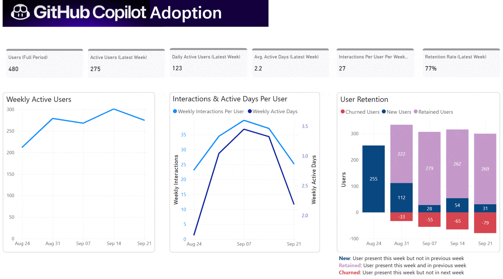

# 🚀 GitHub Copilot Impact
Analytics to show how developers build habits with GitHub Copilot—what features they use, how engagement changes, and what drives adoption. Helps teams and leaders understand usage and show business value.

<strong>✨ What You’ll Get</strong>

- **Track Adoption:**  
  See weekly active users, interaction rates, and retention trends.

- **Segment Engagement:**  
  Spot growing/shrinking segments and power users.

- **Measure Impact:**  
  View code activity and acceptance rates by time and segment.

- **Feature Insights:**  
  Learn which features (chat, panel, agent mode) drive usage.

- **Language & Model Trends:**  
  Find top languages and models with highest acceptance.

<strong>🖼 Preview</strong>

<strong>✅ Requirements</strong>

- Power BI Desktop installed  
- GitHub admin access  
- GitHub Copilot usage data available  

<strong>📥 Get Started</strong>

### 1. Download the Usage File
- Login as admin  
- Navigate to `<placeholder>` and download `<file>`  
- Save it as a **.json** file  

### 2. Connect to Power BI Template
- Download **GitHub Copilot Usage Analytics.pbit**  
- Open the file and set the filepath to your **.json** file (remove quotes)  
- You’re ready to go! 🎉  

